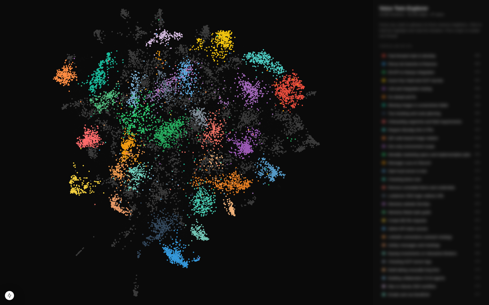

# wispr-flow-voice-twin

A local-first explorer for everything you've spoken into [Wispr Flow](https://wisprflow.ai/). Your year of dictation becomes a searchable corpus, a topical map, an interactive graph, and a voice-aligned writer that drafts new content in your own cadence.

Everything runs on your machine by default. Cloud LLM providers (Azure, OpenAI, Anthropic) are opt-in; the local path uses sentence-transformers for embeddings and [Ollama](https://ollama.com) for generation.



## What it gives you

Three layers, each useful on its own:

1. **The map.** A graph of every dictation you've made, laid out by semantic similarity, colored by topic, with the kNN neighbors visible on hover. Open `localhost:7300` and wander. See the actual themes of your year without anyone telling you what they are.
2. **The voice.** Drafts new content (Slack, LinkedIn, Twitter, blog, email, rewrite, coach) using your past dictations as cadence reference and your style fingerprint as a hard rule. The output reads like you, not like a generic LLM.
3. **The mirror.** Surfaces topics that look like recurring instructions, ranked. The 50th time you tell an AI to "fast-forward main to develop" is the day to write the script.

## Quick start

```bash
git clone git@github.com:Ideaplaces/wispr-flow-voice-twin.git
cd wispr-flow-voice-twin

python3 -m venv .venv && source .venv/bin/activate
pip install -r requirements.txt

# Copy and edit your profile (this stays outside git)
cp profile.example.md ~/.voice-twin/profile.md
$EDITOR ~/.voice-twin/profile.md

cp .env.example .env
echo "VOICE_TWIN_PROFILE=$HOME/.voice-twin/profile.md" >> .env

# Build the corpus once
python pipeline/01_snapshot.py        # safe read-only copy of flow.sqlite
python pipeline/02_ingest.py          # extract dictations to history.jsonl
python pipeline/03_style_profile.py   # compute your per-context fingerprint
python pipeline/04_edit_rules.py      # diff Wispr-formatted vs your edits
python pipeline/05_embed.py           # embed and load into Chroma
python pipeline/06_topics.py          # cluster + label with the LLM
python pipeline/08_visualize.py       # build the explorer graph

# Use it
./cli/voice slack "tell the team I'm pushing the C3 fix today"
./cli/voice blog "the two voices: how I talk to AI vs how I talk to humans"
./cli/topics list
./cli/search "deploying to production"
./cli/patterns list

# Open the explorer
cd web && npm install && npm run dev   # http://localhost:7300
```

## Privacy posture

Local-first by default. The default install does not need any API key.

- **Embeddings** default to `sentence-transformers/all-mpnet-base-v2`, runs on your CPU. No network calls.
- **LLM** (topic labels, voice generation, coach) defaults to Ollama at `http://localhost:11434`. No network calls outside your machine.
- **Source data** stays on your machine: `flow.sqlite` is copied via SQLite's online backup API into `data/snapshot.sqlite`, processed locally, and embedded into a local Chroma database under `data/chroma/`.
- **Profile** lives wherever you point `VOICE_TWIN_PROFILE` at: a path, an https URL, anywhere `requests` can reach. The repo never persists a copy.

If you have credentials for Azure OpenAI, OpenAI, or Anthropic and prefer their quality, the same code switches over with one env var. See [docs/providers.md](docs/providers.md) for the matrix.

For the full privacy walkthrough, see [docs/privacy.md](docs/privacy.md).

## Why this exists

Wispr Flow turns voice into the primary input method. Once you cross a few hundred thousand dictated words, the corpus is the most accurate record you have of how you actually think and what you actually work on. This project turns that record into something you can navigate, query, and use to keep your voice consistent across everything you write.

It started as a personal tool, then we noticed it was useful for anyone with a Wispr Flow corpus, and now it's open source.

## How it fits together

```
flow.sqlite (Wispr Flow source)
    ↓  pipeline/01_snapshot   safe copy
    ↓  pipeline/02_ingest     extract to history.jsonl
    ↓  pipeline/03_style      style fingerprint per context
    ↓  pipeline/04_edit_rules diff Wispr formatting vs your edits
    ↓  pipeline/05_embed      Chroma vector store
    ↓  pipeline/06_topics     BERTopic clusters + LLM labels
    ↓  pipeline/07_ingest_delta   incremental updates from new dictations
    ↓  pipeline/08_visualize  graph artifact for the explorer
    ↓  pipeline/09_patterns   automation candidate detection

cli/voice  <mode> "topic"   draft in your voice (slack/linkedin/blog/...)
cli/topics list/show/find    browse the topical map
cli/search "..."             semantic search across the corpus
cli/patterns list/show/suggest    find recurring instructions

web/                         Next.js + sigma.js explorer at localhost:7300
```

The continuous loop (Mac launchd export → Ubuntu cron ingest) is documented in `docs/scheduling/`.

## Configuration

Three env vars matter:

```bash
# Where your private profile lives. Local path or https URL.
VOICE_TWIN_PROFILE=$HOME/.voice-twin/profile.md

# Which embedding provider. local | azure | openai | auto
EMBED_PROVIDER=local

# Which LLM provider. local (=ollama) | azure | openai | anthropic | ollama | auto
LLM_PROVIDER=auto
```

`auto` picks the first one with credentials, falling back to local. See [docs/providers.md](docs/providers.md) for the full matrix and per-provider env vars.

## License

MIT. See [LICENSE](LICENSE).

## Contributing

Pull requests welcome, especially:

- New ingest sources beyond Wispr Flow (Evernote, Apple Notes, Bear, Obsidian markdown, calendar transcripts).
- An MCP server so any Claude Desktop / Claude Code / Cursor session can call into the corpus.
- Better local-LLM defaults as smaller models improve.
- Cross-platform path detection refinements.

This project lives in the [IdeaPlaces](https://ideaplaces.com) ecosystem.
